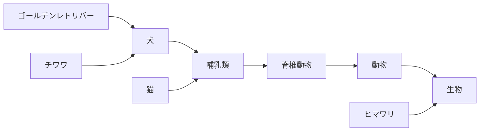

# ImageNet の構築 - WordNet の出現

 

[WordNet](https://wordnet.princeton.edu/)とは単語の関係をグラフとして解釈するためのデータベースです。

例: 「ゴールデンレトリバー」

例: 「ゴールデンレトリバー」とその周辺

例: 「ゴールデンレトリバー」と「猫」を WordNet を使って比較

<arrow x1="100" y1="300" x2="150" y2="270" width="2" arrowSize="1" />

  
<arrow x1="300" y1="480" x2="310" y2="400" width="2" arrowSize="1" />

<Circle x="413" y="333" r="45" width="2" color="red" />

<arrow x1="475" y1="255" x2="430" y2="290" width="2" arrowSize="1" />

ここまで同じ

<!--

-->
