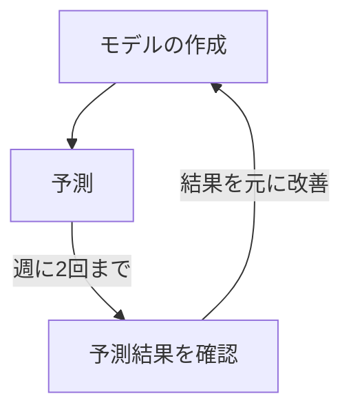
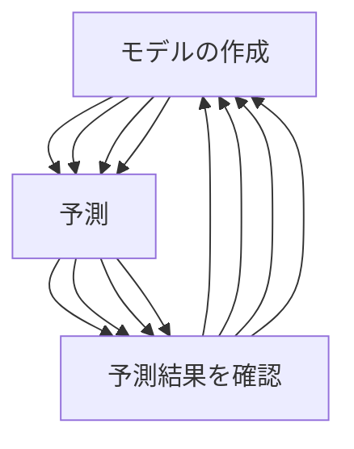

# ImageNet 競技会 - チートをしてでも

 

2015 年に百度のチーム、「データスヌーピング（データののぞき見）」と呼ばれる _ズル_ を行った。

一般的な流れ

百度のチーム

何度もテストの結果を得ることで、テストデータに適合したモデルを作成可能に

<!--

ImageNet 競技会での優勝が単なる研究的な側面だけではなく、企業にとっての営利活動としての側面を持ちはじめたころに事件はおきました。

ズルをしてしまった理由は、相手よりも優れたプログラムを開発しなければならないという重圧によるものだった。

もちろん、テストデータを使った学習は説明するまでもなくしてはならない行為だ。

当たり前だが、この大会では百度のチームは失格となることとなった。

また、優勝チームのトップ５正答率は95％を超えており、他のチームもかなり高い結果を出している。
-->
